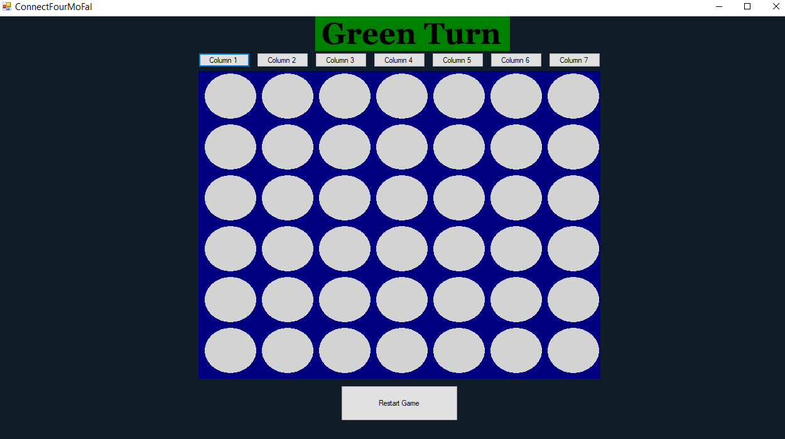
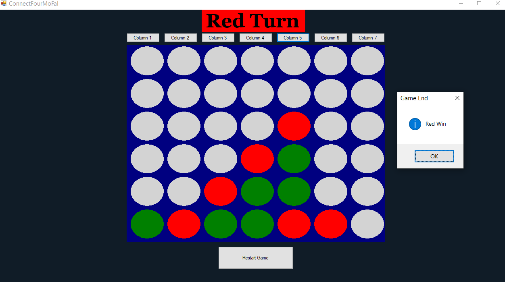

# Connect Four - C# WinForms Implementation

 

A faithful implementation of the classic Connect Four game with clean C# WinForms architecture.

## 🔥 Features
- **Turn-based gameplay** (Red vs. Green)
- **Win detection** in all directions (horizontal, vertical, diagonal)
- **Draw detection** when board is full
- **Visual feedback** with colored discs and turn indicator
- **Restart functionality** for quick replay
- **OOP architecture** with separated concerns:
  - `GameEngine`: Core game logic
  - `BoardRenderer`: Handles visual representation
  - `GameController`: Mediates between UI and engine

## 🛠️ Technical Highlights
- **WinForms graphics** with `System.Drawing`

- **Enum-driven state management**:
 
  public enum enGrid { empty = 0, green = 1, red = 2 };
  public enum enPlayerTurn { greenTurn = 1, redTurn = 2 };

- Efficient win checking using directional counting:

private int CountCirclesAround(int startRow, int startCol, int stepRow, int stepCol, enGrid player)
{
    
}

## 🚀 How to Run

   1- Clone this repository

   2- Open ConnectFour.sln in Visual Studio

   3- Press F5 to run!

## 📸 Screenshots

 
 

## 🤝 Contributing

While this is a personal portfolio project, suggestions are welcome! Open an issue or fork the repository.

